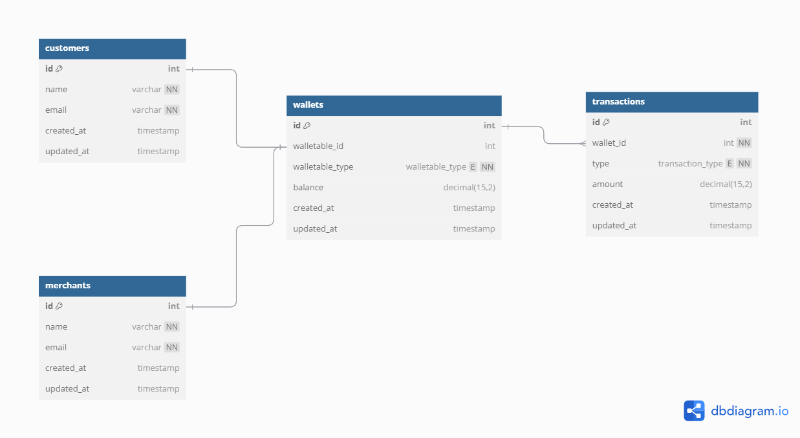

# Wallet API Service

This repository contains the Wallet API Service, built with Laravel, designed to manage customer and merchant wallets, perform transactions, and retrieve transaction histories.

## Table of Contents

- [Features](#features)
- [ERD Diagram](#erd-diagram)
- [API Documentation](#api-documentation)
- [Installation](#installation)
- [Testing](#testing)
- [Postman Collection](#postman-collection)
- [Future Enhancements](#future-enhancements)
- [Contributions](#Contributions)

## Features

- **CRUD Operations:**
  - Manage Customers
  - Manage Merchants
- **Wallet Operations:**
  - Create Wallets
  - Debit and Credit Wallets
  - Fetch Wallet Details
  - Fetch a List of Wallets (Paginated)
  - Fetch Wallet Transaction History (Paginated)
- **Validation and Error Handling:**
  - Comprehensive input validation and error responses.
- **Cron Job:**
  - Automated job to identify wallets with discrepancies between balance and transactions.
  
## ERD Diagram

The Entity-Relationship Diagram (ERD) for the database schema is shown below:



This ERD represents the relationships between customers, merchants, wallets, and transactions.

## API Documentation

The API documentation is available through the Postman collection provided in this repository. It covers all the endpoints for managing wallets, customers, merchants, and transactions.

### Endpoints Overview

- **Customers**
  - `POST /api/customers` - Create a new customer
  - `GET /api/customers/{id}` - Fetch a specific customer
  - `PUT /api/customers/{id}` - Update a customer
  - `DELETE /api/customers/{id}` - Delete a customer

- **Merchants**
  - `POST /api/merchants` - Create a new merchant
  - `GET /api/merchants/{id}` - Fetch a specific merchant
  - `PUT /api/merchants/{id}` - Update a merchant
  - `DELETE /api/merchants/{id}` - Delete a merchant

- **Wallets**
  - `POST /api/wallets` - Create a new wallet
  - `GET /api/wallets/{id}` - Fetch wallet details
  - `POST /api/transactions` - Debit and Credit a wallet
  - `GET /api/wallets` - Fetch a list of wallets (Paginated)
  - `GET /api/wallets/{walletId}/transactions` - Fetch wallet transaction history (Paginated)

## Installation

**Install dependencies**
```
composer install
```

**Set up the environment**
- Duplicate the .env.example file and rename it to .env.
- Configure the environment variables, including database connection details.
- Configure the .env.testing file, include the test database connection details

**Serve the application**
```
php artisan serve
```

## Testing

In the command line, run
```
php artisan test
```

## Postman Collection

The Postman collection file (wallet-service-api.postman_collection.json) is included in the repository. Import this collection into Postman to test the API.
Also, [Published collection](https://documenter.getpostman.com/view/37584024/2sA3s3HrVR)

## Future Enhancements

- **Redis Caching:**
  - Implementing Redis caching could significantly improve the performance of the API by reducing the load on the database for frequently accessed data. This could be particularly useful for endpoints that retrieve wallet details or transaction histories.
  - Future updates could include caching mechanisms for these endpoints, with cache invalidation strategies to ensure data consistency.

## Contributions

Contributions are welcome! Please submit a pull request with a detailed description of your changes.